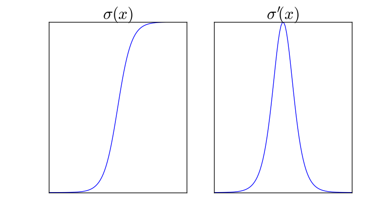
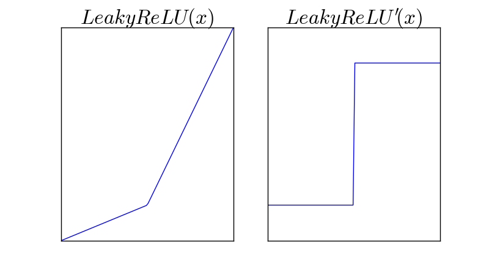
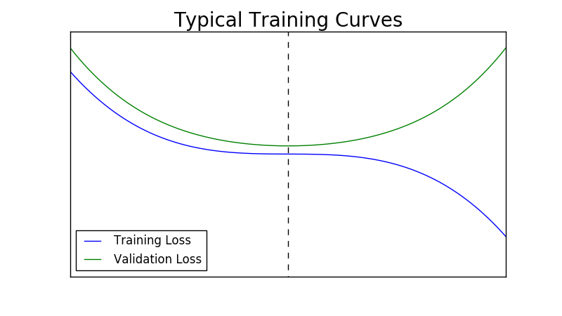

# Neural Networks Tips and Tricks

We've seen how to build and train neural networks from scratch, and also leveraging Keras to interface with Tensorflow. Doing this has meant making many decisions, some of them which seem arbitrary. In reality, we've been making some sub-optimal decisions along the way. In this session we'll introduce some of the common tips and tricks people use to train neural networks. Specifically we will take a look at activation functions, weight initialization, loss functions, optimizers, and how to prevent overfitting.

## Activation Function

Recall that the activation function is the non-linear function on the "second-half" of your artificial neuron. This is one of the functions we need to differentiate to be able to do backpropagation. Initially we chose the sigmoid function because of historical and neuroscience reasons, however, there are many reasons not to use this family of functions. The most important problem is known as the vanishing gradient.

Remeber that what we want is for our neurons to learn features that excite them (high values coming out of our sigmoid), or inhibit them (low values coming out of our sigmoid). Notice what happens to the gradient when we achieve those goals: the gradient itself goes to zero. This means that if one neuron learns exactly what it needs to, it will make it harder for neurons that precede to learn, since the gradient will shrink.

There are many different kinds of activation functions; the most important features we need are that it be a non-linear function, and that it avoid the vanishing gradient problem. Rectified Linear Units (ReLUs) were chosen to combat vanishing gradients. They are in essence a piece-wise function that returns 0 for $x<0$, and $y=\alpha x$ for $x>0$, where $\alpha$ is some paremeter you can set. This function will always have a constant gradient when $x>0$, so we avoid the vanishing gradient problem. We can make a small correction to arrive at Leaky Rectified Linear Units (Leaky ReLUs), this activation function just changes the value of the ReLU to $y=\beta x$ for $x<0$. Now the function will have well-defined, non-vanishing gradients in both directions, and it still non-linear.

Aditionally another function that is used often is the softmax function. The softmax function is used so that the output of all the neurons in that layer will sum up to one. This is useful if you need the output of your network to be a probability distribution. We cannot use the max function because it is actually non-differentiable. The softmax instead tries to re-weight the outputs of the neurons, while still pushing the max substantially higher than the others.

## Weight Initilization

This might seem like a weird parameter to tune, but it turns out that the random distribution that you use to start your network weights ends up greatly affecting training time. People commonly use a normal distribution, or a uniform distribution from -1 to 1. There is a great [paper](http://proceedings.mlr.press/v9/glorot10a/glorot10a.pdf) by Xavier Glorot and Yoshua Bengio where they find that their normalized initilization of weights performs substantially better than just a standard normal distribution. It essentially boils down to picking weights from  a uniform distribution starting from $-\frac{\sqrt{6}}{\sqrt{n_j + n_{j+1}}}$ to $\frac{\sqrt{6}}{\sqrt{n_j + n_{j+1}}}$, where $n_j$ is the number of neurons in the current layer and $n_{j+1}$ is the number of neurons in the next layer.

Thankfully Keras will automatically initialize your weights using these finding, so you don't have to worry about it. I only mention it for awareness and to highlight how almost every decision made impacts performance.

## Loss Functions

Loss functions are probably the most important design decision that you will make in a neural network. This is the function that your algorithm will train to minimize as much as possible. As a result it is directly linked to performance. We started these sessions looking at the mean squared error:

$\frac{1}{2N} \sum_i^N (f(x_i) - y)^2$

This function is actually intended to be used for regression problems; these are problems where you want your model to mimic some function so that you can interpolate between the data points you already have. Initially this sounds like a good idea for any problem, but we can choose better cost functions depending on the problem.

For classification problems we can instead minimize different kinds of probability divergences (sort-of distance). We can think of trying to reduce the entropy between the distribution of our training set, and the distribution that our network makes. Cross-entropy loss is the most famous of these kind of loss functions:

$H(p,q) = -\sum_x p(x)log(q(x))$

Think of this function as measuring how much extra work you'd have to do to communicate information about q using a channel optimized for p. If p is our training set, we want to minimize the amount of work to communicate our network's results q.

Cross-entropy is great for binary classification (only two options), but it can also be extended for multiple classes. All of these loss functions are easily available through Keras. It is important to remember to use a softmax activation as your last layer if you use these losses!

### What about embeddings?

We can make our loss function be anything we want, so long as the extrema of the function correlates with the goals we want to achieve. This is exactly what the FaceNet paper does. They define a new kind of loss called a triplet-loss. This loss requires evaluating the network three different times. On the first two passes you pick two inputs that have the same class ($x$ and $x_{same}$), for the third pass they pick an input that has a different class ($x_{diff}$). They then calculate the distance between $x$ and $x_{same}$ and ask the network to minimize that, and calculate the distance betweek $x$ and $x_{diff}$ and ask the network to maximize that. In an ideal world this means that overtime, the distance between the network outputs will be small if the inputs are similar classes, and large if they are not. In this way they can map a picture of a face to a lower dimensional space that has the property that distance correlates to similarity.

## Optimizers

We started our journey by looking at stochastic gradient descent. This is still the backbone of most modern optimizers, but they are usually augmented in different ways. The most important advances are centered around using momentum and dynamically chosing learning rates to train faster.

Momentum allows the optimizer to retain some memory about which direction the optimization procedure was taking in previous iterations. This allows the optimizer to skip local minima, or to avoid being trapped if the approximations to the loss function were not accurate.

By keeping track of how the gradients are changing it is possible to dynamically pick learning rates. In areas with high gradients it might be possible to increase the learning rate to move through these areas faster. If the gradients start to disappear it might be necessary to reduce the learning rate so that the optimizer doesn't shoot over the minima.

The most popular optimizer nowadays is ADAM, followed by RMSProp. These are both easy to access through Keras.

## Preventing Overfitting

This is where most of the tricks exist in today's neural network landscape.
The crux of the problem is the following: If you include too many parameters in your network model, your network will memorize the training set; if you don't include enough parameters your network will perform poorly in both training and testing.

We need to have ways of preventing our network from memorizing our training set. I'll go over the 5 most common tricks that are used for this:

  1. Early Stopping
  2. Weight Penalty
  3. Data Augmentation
  4. Dropout
  5. Pick a better architecture
  
### Early Stopping
This one is pretty simple. Some time before your network start to memorize the training set is must learn how to pick out useful features. So if you can stop the training before it goes past this point you will prevent overfitting. This will work, wthout a doubt, but it might not be the most efficient way to use the full capacity of your network.

In Keras this can be implemented using the EarlyStopping callback function. It will chech the loss on the validation set, and if it starts to go up it will start a counter. If the validation loss goes up for more than some number of epochs, the callback will end the training procedure.

### Weight Penalty
Weight penalties are an idea borrowed from the field of regression. It is emperically observed that for the network to overfit it will tend to raise some of the weights to extremely high values. The network does this because it needs to have a sharp threshold between a memeber of the training set and anything else. To combat this we can penalize the network's loss function for choosing large weights. We can tack on an extra term to our loss function that adds the norm of the weight vectors to the loss. If the optimizer wants to minimize the new loss function it must try to find a minima that doesn't make the weights too large. Notice that the penalty doesn't set some max weight, or some weight budget. Rather if the weights needs to be large, then the expected return on that investment must also be large.

There are a couple of weight penalties. The most common ones are the $L^2$ penalty (norm of the weghts) and the $L^1$ penalty. The first one encourages the network disregard small eigenvalues in the problem, while the second one encourages the network to make sparse connections. Both of these are easy to access through Keras, and they can be implemented on a per layer basis, or for the whole network.

### Data Augmentation
Realistically the only way to stop overfitting completely is to collect data that covers every possible input. However this usually not a possibility. Instead we turn to ways to use the data we have as best as possible, by doing small transformation on the data. Data augmentation is the act of changing the data in such a way that we are sure that the class of the data has not changed after the transformation. Images in object classification problem are prime examples of data that can be easily augmented. If you shift an image by one pixel to the right, the identity of some object in the image has not changed. You could also flip the image about the vertical axis (mirroring) and it will stil be a valid image with the same class. Small afine transformation and rotations are also sometimes used.

This prevents your network from overfitting because it forces the network to look at a vast quantity of data. It is however still possible to overfit, if for example there is an over-representation of a class in your data. It is also important to realize that doubling the amount of data through augmentation is not the same as doubling the amount of information in your data. The augmented data set will be highly correlated to the original data set, which means the risk of overfitting is mitigated, not eliminated.

Because data augmentation is very problem specific Keras doesn't have a built-in function that will work on any data set. It does however, have data augmentation tools for images. They can be found in the preprocessing module.

### Dropout
One way to prevent overfitting is to force the network to be robust to a variety of inputs. Dropout is a simple, but incredibly powerful, technique to do this. A dropout layer is inserted between two hidden layers, and it will at random drop some activations to zero during training. This means that the next layer will have to learn to be resilient to missing data from the previous layer. This resiliency means that the network has to dedicate resources to learning robust features over the training set, features that can carry over to the testing set. Dropout is really popular because it directly targets overfitting. At each mini-batch the neurons that are dropped out change at random, meaning that the neurons need to communicate in a way that adds redundancy. There are some minor details to make this work better: the other activations are scaled based on how many inputs are dropped out, the rate of the drops can be tweaked, etc.

Dropout is a layer in Keras that you can add to your model. I cannot state enough how useful this technique is.

### Better Architecture
If all else has failed it might be time to consider making a more complicated neural network architecture. So far we have considered MLPs and CNNs, but there are also many other famous architectures. There are architectures like Residual Networks (ResNets) which have been shown to be able to efficiently train over 1000 layers, or the Inception network, which has a node composed of three convolutional layer towers. The all convolutional (AllConv) network is another famous architecture that replaces all dense layers in a normal CNN with convolutional layers. Then you start getting into more esoteric networks like GoogLeNet, which has many branching paths leading to auxillary classifiers, or networks specifically made to use depth information in images. 

The previous networks are all used for computer vision. In the space of speech recognition, recurrent neural networks (RNNs) are common, but even those have variants, such long short-term memory (LSTM) networks, or gated recurrent units (GRUs). If your problem is unsupervised (dimensionlaity reduction, or clustering), then you have access to autoencoders, variational autoencoders, generative adversarial networks, etc.

And of course for our facial recognition problem you can make networks that create embeddings, like FaceNet, or word2Vec.
The point is that there is a wide world of neural network architectures, and they are purpose made to get the best accuracy out of your data set.

# Exercise

For this session you should read the [FaceNet paper](https://arxiv.org/pdf/1503.03832.pdf). At minimum the introduction and methods. Then think about how to implement such an architecture using the skills you already have.

After that visit [Clarifai's website](https://clarifai.com/) and take a look through their pre-trained models and follow their [getting started](https://clarifai.com/developer/guide/) guide. We are aiming to use their pre-trained face embedding model!
